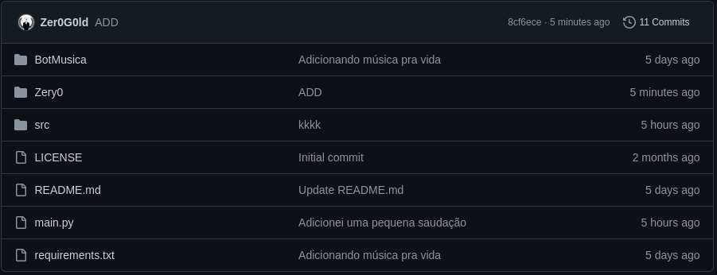

# Zero

## Explicação 
Você deve ter reparado que tem varios arquivos pro bot do discord
o arquivo main.py é apenas um exemplo de como faz um bot simples em python
dentro da pasta de música é um código de um bot direcionado apenas para tocar música no servidor ( ainda não está completo )
dentro da pasta Zery0 tem um bot interativo com alguns comandos basicos e facieis


## Instalação via Git

```
git clone https://github.com/Zer0G0ld/BotZabbix.git
```

# Ambiente Virtual - AV
Criando ...
```
python3 -m venv venv

```

Ativando no Linux ou MacOS
```
source venv/bin/activate

```

Ativando no Windows
```
.\venv\Scripts\Activate
```

Desativando ...
```
deactivate

```

### Instalando dependências

```
pip install -r requirements.txt
```

## Bot de música
### Ainda em fase de desenvolvimento ...
na pasta de música tem que ser instalado o ffmpeg

Linux
```
sudo apt-get install ffmpeg
```
